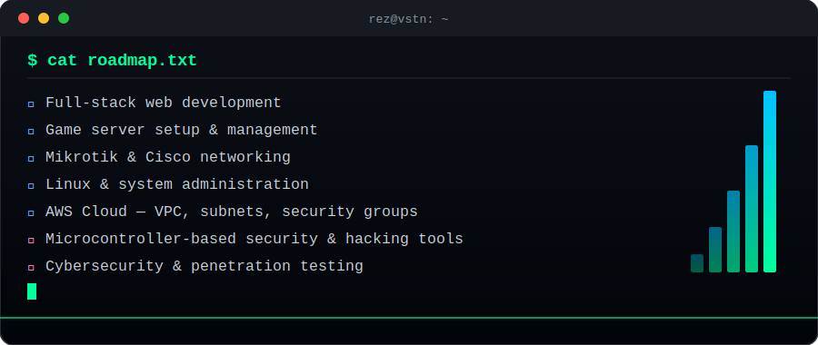

# Hi, I'm rez 👋

**Infrastructure, Networking & Systems**

🌐 Portfolio: [vstn.cloud](https://vstn.cloud)

---

### 🛠️ Technical Stack

**Cloud & Infrastructure**

**Networking**

**Database & Storage**

**Backend & Systems**

**Frontend**

**Security & Web Server**

---

### 🗺️ Roadmap

---

### 📫 Connect with me

---

💡 *Building and breaking infrastructure, one server at a time.*

